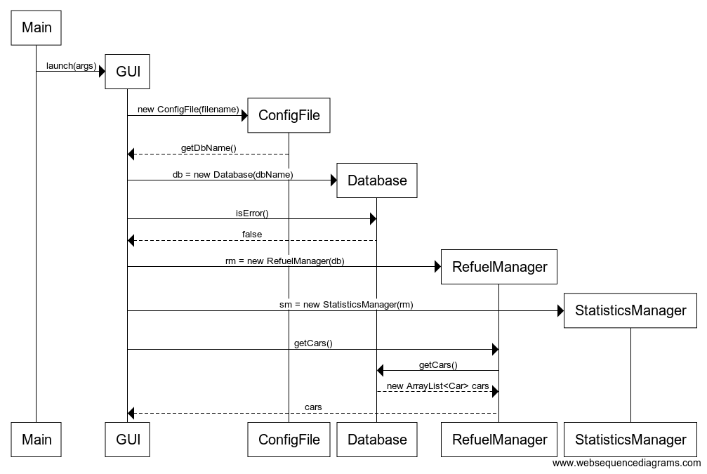
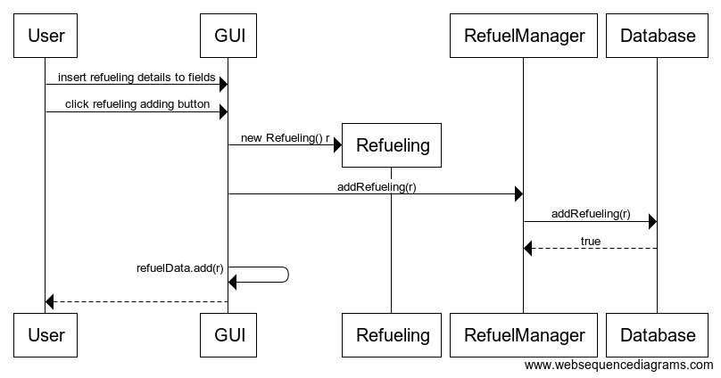

# Architecture

## Structure

* _fuellogger.ui_ contains a graphical user interface.
* _fuellogger.logic_ contains the main application logic that manages
cars and refuelings. It also performs calculations used for statistic
views and charts. 
* _fuellogger.domain_ contains the Car and Refueling classes that are
used to store information in the application.
* _fuellogger.dao_ contains classes used to save data into the hard
disk. (SQLite database and config file)

## Application logic
Application logic is implemented with the _RefuelManager_ and
_StatisticsManager_ classes. 
* __RefuelManager__ manages and stores cars and refuelings. It also
uses _Database_ class to store data to the database. 
	* Adding a car
	* Listing of cars
	* Adding a refueling
	* Listing of refuelings
	* Listing of refuelings by month and year
* __StatisticsManager__ performs calculations to be displayed in the
graphical 
	* Getting statistics of a car
	* Getting statistics of refuelings
	* Output data to generate charts in the GUI

Logic classes use the _Car_ and _Refueling_ classes from _fuellogger.domain_
package to store the information locally. _RefuelingManager_ uses 
_Database_ class from _fuellogger.dao_ package to save the data to a
SQLite database. 

## Class diagram

### Startup sequence

JavaFX GUI is launched. GUI creates a new ConfigFile. Database name
value is read from ConfigFile. A new Database is created with dbName.
A new RefuelManager is created with the Database. A new StatisticsManager
is created with RefuelManager. GUI asks RefuelManager for a list of
cars. RefuelManager fetches cars from the Database. A list of cars is
shown in the GUI.

### Car adding sequence diagram

User inserts car's details in fields and clicks car adding button. 
A new car object is created and addCar() method in RefuelingManager
class is called. RefuelManager tries to add car into the Database with
Database's addCar() method. If it returns true the car is also added
into RefuelManager's local ArrayList of cars. The created car object is
added to GUIs observablelist.

### Refueling adding sequence diagram

User inserts refueling details in fields and clicks adding button. 
A new refueling object is created and addRefueling() method in
RefuelingManager class is called. RefuelManager calls Database's
addRefueling(). If it returns true, the refueling is also added into
RefuelingManager's local HashMap of <Car, Refueling> pairs.
Databases addRefueling() tries to insert refueling into the database, if
the insertion is success it returns true. The created refueling object
is added to GUIs observablelist.
