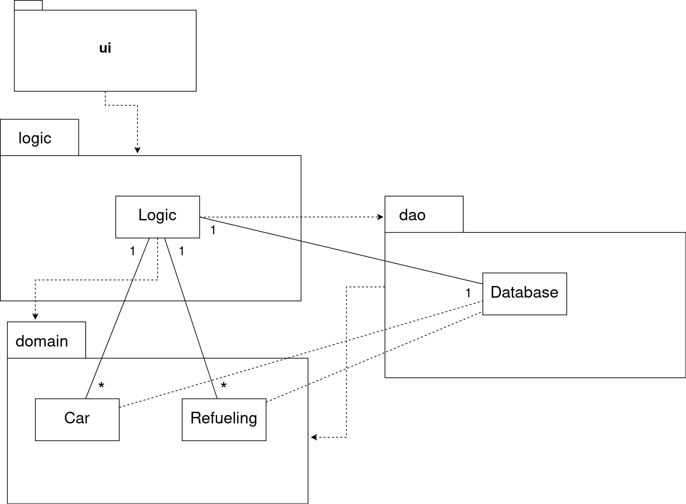

# Architecture

## Structure

* _fuellogger.ui_ contains a graphical user interface.
* _fuellogger.logic_ contains the main application logic that manages
cars and refuelings. It also performs calculations used for statistic
views and charts. 
* _fuellogger.domain_ contains the Car and Refueling classes that are
used to store information in the application.
* _fuellogger.dao_ contains classes used to save data into the hard
disk. (SQLite database)

## Application logic
Application logic is implemented with the _Logic_ class. The application
logic consists of storing and managing the _Car_ and _Refueling_ objects
and performing calculations to generate statistics to be displayed in
the graphical user interface.

### Functions of the logic class
* Adding a car
* Listing of cars
* Adding a refueling
* Listing of refuelings
* Getting statistics of a car
* Getting statistics of refuelings
* Output data to generate charts in the GUI

Logic class uses _Car_ and _Refueling_ classes from _fuellogger.domain_
package to store the information locally. It uses _Database_ class from
_fuellogger.dao_ package to save the data to a SQLite database. 

### Car adding sequence diagram

User inserts car's details in fields and clicks car adding button. 
A new car object is created and addCar() method in Logic class is
called. Logic object adds car in it's local arraylist of cars and calls
Database objects addCar() method. Databases addCar() tries to insert car
into the database, if the insertion is success it returns true. The
created car object is added to GUIs observablelist.

## Class diagram

