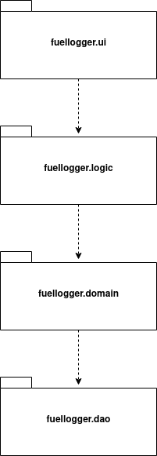

# Architecture

## Structure

* _fuellogger.ui_ contains a graphical user interface.
* _fuellogger.logic_ contains the main application logic that manages
cars and refuelings. It also performs calculations used for statistic
views and charts. 
* _fuellogger.domain_ contains the Car and Refueling classes that are
used to store information in the application.
* _fuellogger.dao_ contains classes used to save data into the hard
disk. (SQLite database and config file)

## Application logic
Application logic is implemented with the _RefuelManager_ and
_StatisticsManager_ classes. 
* __RefuelManager__ manages and stores cars and refuelings. It also
uses _Database_ class to store data to the database. 
	* Adding a car
	* Listing of cars
	* Adding a refueling
	* Listing of refuelings
	* Listing of refuelings by month and year
* __StatisticsManager__ performs calculations to be displayed in the
graphical 
	* Getting statistics of a car
	* Getting statistics of refuelings
	* Output data to generate charts in the GUI

Logic classes use the _Car_ and _Refueling_ classes from _fuellogger.domain_
package to store the information locally. _RefuelingManager_ uses 
_Database_ class from _fuellogger.dao_ package to save the data to a
SQLite database. 

### Car adding sequence diagram

User inserts car's details in fields and clicks car adding button. 
A new car object is created and addCar() method in RefuelingManager
class is called. Logic object adds car in it's local arraylist of cars
and calls Database objects addCar() method. Databases addCar() tries to
insert car into the database, if the insertion is success it returns
true. The created car object is added to GUIs observablelist.

## Class diagram

