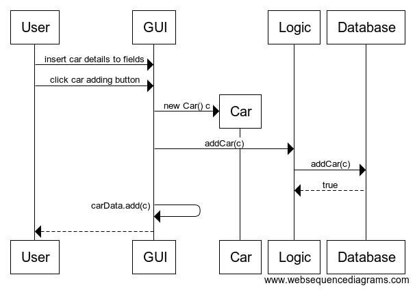

## Car adding sequence diagram

User inserts car's details in fields and clicks car adding button. 
A new car object is created and addCar() method in Logic class is called.
Logic object adds car in it's local arraylist of cars and calls Database objects addCar() method.
Databases addCar() tries to insert car into the database, if the insertion is success it returns true.
The created car object is added to GUIs observablelist.
