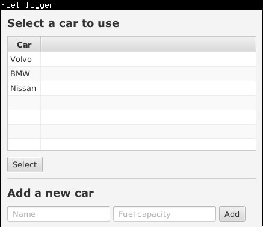
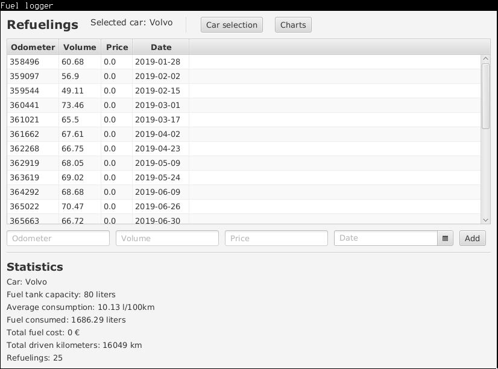
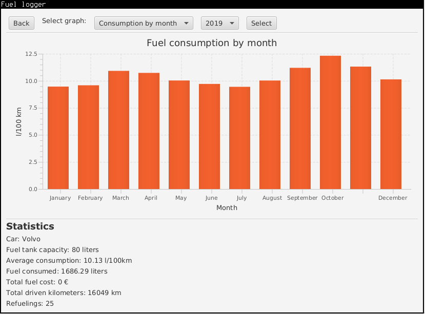

# User manual
## Running
### From Maven
```mvn compile exec:java -Dexec.mainClass=fuellogger.Main```
### Jar file
```java -jar fuel-logger-1.0-SNAPSHOT.jar```
or ```java -jar fuel-logger.jar``` depending on the filename. 

## Configuration
The application generates automatically database file called
_database.db_ and a config file _fuellogger.conf_ into the folder from
which it is executed. There is no need to configure the software in
normal use use but if desired, the user can change the database file
used using the _fuellogger.conf_ file. 

The config file looks like this
```dbname=database.db```
The database name can be changed by changing _database.db_ to some other
name. 

## Usage
All data inserted to the application is automatically stored in the
database.
### Car selection view
When the application is launched, it will initially open in the car
selection view. A new car can be added with the dialog at the bottom.
A car needs a name and fuel tank capacity in liters. Select the car from
the list and click "Select" button to continue. 


### Refueling view
Refueling view shows a list of refuelings for the selected car. A new
refueling can be added with the dialog in the bottom. A new refueling
needs following information:
* Odometer value
* Volume in liters
* Price of fuel in euros (per liter)
* Date of refueling
Fill in the information and click the "Add" button. At least two
refuelings are required to measure the average consumption. Statistics
of the car are shown in the bottom. Press "Charts" for the charts view
or press "Car selection" to go back to the car selection. 


### Charts and graphs
Click the "Charts" button in refueling view to show the charts view. 
There are currently three charts available
* Fuel consumption by month
* Cost by month
* Kilometers by month
Select the chart and year from the drop-down menus and click "Select".
The graph will be shown. Click "Back" to go back to the refueling view. 

